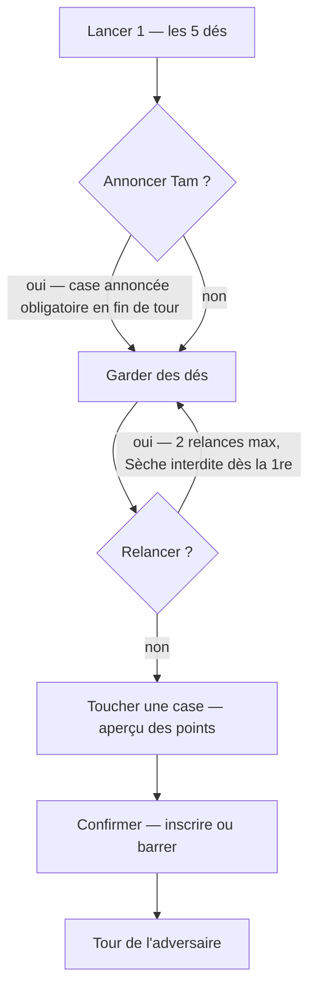
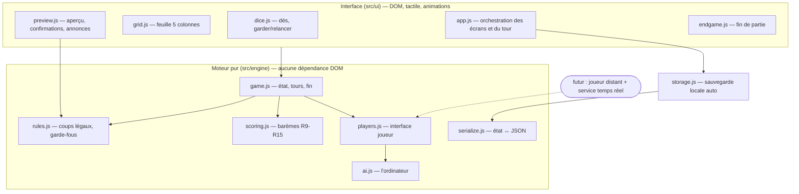

# Jeu de Yam Solo - Plan

## Goal Capsule

- **Objectif :** une v1 jouable du Yam de Leslie — appli web pensée téléphone d'abord, partie solo contre un ordinateur « correct mais battable », feuille maison à 5 colonnes reproduite à l'identique. Le solo est un jalon de validation rapide : le multijoueur en ligne en direct (chacun sur son téléphone) est la suite immédiate, et la v1 doit le préparer.
- **Autorité produit :** Leslie (utilisatrice unique et propriétaire des règles). La feuille de référence est `docs/reference/feuille-yam-originale.docx` ; les barèmes chiffrés du présent contrat font foi.
- **Hiérarchie d'autorité :** le Product Contract (le QUOI) prime sur le Planning Contract (le COMMENT) en cas de conflit ; le présent plan prime sur toute convention générale.
- **Profil d'exécution :** agent autonome. Les tests du moteur (Verification Contract) doivent être verts avant de poursuivre au-delà de chaque unité. Toute question de comportement produit non tranchée par le Product Contract est un blocage : s'arrêter et demander, ne pas inventer.
- **Blocages ouverts :** aucun.

---

## Product Contract

### Summary

Une appli web de Yam jouable au doigt sur téléphone : Leslie affronte un ordinateur qui joue la même feuille qu'elle, avec ses règles maison exactes (colonnes Descendante, Libre, Montante, Tam, Sèche).
La grille complète reste visible pendant toute la partie, la partie se sauvegarde automatiquement, et l'ambiance visuelle est épurée et chaleureuse.
Ce solo sert de banc d'essai : le multijoueur en ligne en direct, chacun sur son téléphone, suit immédiatement — la v1 le prépare sans l'inclure.

### Key Decisions

- **Solo = jalon de test, multi en ligne en direct = suite immédiate** (session-settled: user-directed — chosen over un multi inclus dès la v1 : Leslie veut d'abord valider le moteur et l'écran en solo, très vite, puis basculer aussitôt vers des parties en direct où chacun joue depuis son téléphone). La v1 prépare activement cette bascule (R16, R26, R27), et le solo reste ensuite un mode à part entière, proposé au démarrage à côté du multi (R28).
- **Appli web, téléphone d'abord** (session-settled: user-approved — chosen over app native App Store : rien à installer, pas de compte développeur, utilisable aussi sur ordinateur).
- **Écran « feuille entière »** (session-settled: user-directed — chosen over « colonne par colonne » et « dés d'abord », après comparaison de maquettes : Leslie veut la vision globale de la vraie feuille papier).
- **Ambiance épurée et chaleureuse** (session-settled: user-directed — chosen over « table de casino » et « coloré familial », après maquettes : fond crème, encre chaude, accent terracotta).
- **Ordinateur « correct mais battable »** (session-settled: user-approved — chosen over un adversaire coriace ou des niveaux réglables : le plaisir de gagner régulièrement prime en v1).
- **Règles maison comme unique référentiel** (session-settled: user-directed — chosen over le Yahtzee classique : la feuille familiale de Leslie, validée point par point en dialogue).

### Actors

- A1. Leslie — la joueuse, sur son téléphone (ou un ordinateur).
- A2. L'ordinateur — adversaire automatique intégré à l'appli ; il joue la même feuille, avec exactement les mêmes règles et contraintes que la joueuse. Absent des modes « Jouer seule » (R29) et « À plusieurs » (R31).
- A3. Les joueuses et joueurs locaux du mode « À plusieurs » (R31) — 2 à 5 humains sur le même téléphone, à tour de rôle.

### Requirements

**Moteur de jeu — déroulé**

- R1. Un tour = jusqu'à 3 lancers de 5 dés ; entre les lancers, le joueur garde ou relance librement chaque dé ; il peut s'arrêter après le 1er ou le 2e lancer.
- R2. La feuille compte 5 colonnes × 13 cases à remplir (1, 2, 3, 4, 5, 6, Quinte, Full, Carré, +, Moyen, −, Yam), plus deux lignes calculées par colonne : Total (60) et TOTAL. Chaque tour se conclut par l'inscription (ou le barrage) d'exactement une case ; la partie se termine quand chaque joueur a rempli ses 65 cases ; le vainqueur a le meilleur TOTAL général (somme des 5 colonnes).
- R3. Colonne Descendante : les cases se remplissent dans l'ordre strict du 1 vers le Yam.
- R4. Colonne Montante : ordre strict inverse, du Yam vers le 1.
- R5. Colonne Libre : n'importe quel ordre.
- R6. Colonne Tam : jouable uniquement sur annonce faite immédiatement après le 1er lancer du tour ; l'annonce désigne une case précise, encore vide, de la colonne Tam ; le joueur conserve ses lancers restants ; en fin de tour, l'inscription dans la case annoncée est obligatoire, réussie ou non (ratée → 0) ; l'ordre dans la colonne est libre ; annoncer reste facultatif à chaque tour. À l'écran, l'annonce se fait en touchant une case vide de la colonne Tam juste après le 1ᵉʳ lancer, avec une confirmation dédiée (« Annoncer Tam sur cette case ? »), distincte de la confirmation d'inscription de fin de tour.
- R7. Colonne Sèche : une case ne s'y inscrit que sur le résultat du 1er lancer du tour ; toute relance interdit la Sèche pour ce tour ; ordre libre. Les combinaisons (Quinte, Full, Carré, Yam) doivent être réalisées au 1er lancer ; les cases 1 à 6 prennent la somme des dés de la valeur visée au 1er lancer, même avec un seul dé ; +, Moyen et − prennent la somme des 5 dés du 1er lancer.
- R8. Toute case peut être volontairement barrée (0 point), dans le respect des contraintes de sa colonne : l'ordre pour Descendante et Montante, l'annonce préalable (ratée) pour Tam, l'absence de relance ce tour-ci pour la Sèche. L'appli interdit toute action qui laisserait le tour sans coup légal : si seules des cases Sèche restent jouables, la relance est bloquée avec explication ; si seules des cases Tam restent, l'annonce est proposée d'office après le 1ᵉʳ lancer.

**Moteur de jeu — barème**

- R9. Cases 1 à 6 : somme des seuls dés de la valeur visée (trois 4 dans la case « 4 » = 12 ; un Yam de 3 dans la case « 3 » = 15).
- R10. Ligne Total (60), calculée par colonne avec T = somme des cases 1-6 : si T ≥ 60, le score est 90 + 5 × (T − 60) ; si T < 60, le score est T − 5 × (60 − T). Exemples qui font foi : 63 → 105 ; 65 → 115 ; 60 → 90 ; 58 → 48.
- R11. Quinte : exige 5 dés consécutifs (1-2-3-4-5 ou 2-3-4-5-6) ; score = somme des 5 dés + 30 (soit 45 ou 50).
- R12. Full : 3 dés identiques + 2 dés identiques ; score = somme des 5 dés + 20 ; un Yam est accepté comme Full (somme des 5 dés + 20 ; ex. cinq 6 → 50).
- R13. Carré : score = somme des 4 dés identiques + 40 (carré de 6 → 64 ; carré d'as → 44) ; un Yam inscrit au Carré = somme des 5 dés + 40 (Yam de 2 → 50).
- R14. Cases +, Moyen, − : score = somme des 5 dés ; dans chaque colonne, l'inégalité + > Moyen > − doit être vraie entre toutes les cases déjà inscrites du trio au moment d'inscrire — y compris directement entre + et − quand Moyen est encore vide (+ = 11 avec − = 20 est interdit) ; toute inscription qui la viole vaut 0 ; une case du trio barrée ou annulée (0) est neutre et n'impose aucune contrainte aux deux autres — l'inégalité ne s'applique qu'entre les cases portant un score ; leur ordre interne est libre là où la colonne le permet.
- R15. Yam : 5 dés identiques ; score = somme des 5 dés + 60.
- R16. Le moteur de règles (dés, contraintes de colonnes, barème, tours) est strictement séparé de l'interface, de sorte que le mode multijoueur puisse le réutiliser sans réécriture.

**Interface et expérience**

- R17. Interface en français, conçue pour l'écran du téléphone (taille iPhone au minimum) et le jeu au doigt ; l'affichage s'adapte automatiquement aux écrans plus grands — iPad, ordinateur.
- R18. Une fine bande d'en-tête (tour en cours, totaux des deux joueurs, accès « Nouvelle partie ») surmonte la grille complète des 5 colonnes, qui reste visible pendant le jeu ; les dés et la commande de lancer occupent le bas de l'écran ; la grille s'adapte à la taille de l'écran et ne défile jamais. Deux onglets au-dessus de la grille permettent de consulter à tout moment la feuille de chaque joueur (masqués en mode « Jouer seule ») ; tout lancer de dés du joueur au trait ramène automatiquement l'affichage sur sa propre feuille.
- R19. Toucher une case affiche le détail des points qu'elle rapporterait avec les dés actuels et demande confirmation avant d'inscrire ; les cases jouables avec les dés du moment sont signalées visuellement. Toucher une autre case remplace l'aperçu en cours ; toucher hors de la grille (ou « Annuler ») ferme l'aperçu sans rien inscrire. Quand la case vaudrait 0 (contrat manqué ou contrainte violée), l'aperçu ne propose qu'une seule action d'inscription — « Inscrire 0 » — sans bouton « Barrer » redondant ; le barrage volontaire (« Barrer · 0 ») n'apparaît que pour une case qui rapporterait des points.
- R20. Les annonces Tam des deux joueurs s'affichent à l'écran (ex. « L'ordinateur annonce Tam : Carré »).
- R21. Ambiance visuelle épurée et chaleureuse : fond crème, encre chaude, accent terracotta ; palette claire unique en v1.
- R22. Les dés s'animent au lancer ; un Yam réussi déclenche une brève célébration visuelle ; la v1 est sans sons.
- R23. Pendant le tour de l'ordinateur, l'écran bascule sur sa feuille et ses dés : chaque étape (lancer, dés gardés, annonce, inscription) s'affiche à un rythme lisible — environ une seconde par lancer ou garde, deux secondes et demie sur l'inscription avec la case surlignée ; un toucher passe à l'étape suivante. Son niveau : cohérent et battable — il protège son Total (60) (l'enjeu du ± 5 par point d'écart au seuil : jamais un chiffre 3-6 inscrit ou barré à bas coût quand une case à moindre perte existe, viser au moins 3 dés de la valeur), il joue vers une cible explicite (après une annonce Tam, ses gardes servent exclusivement la case annoncée — face annoncée → garder cette face, quinte → garder des valeurs uniques), ses annonces Tam sont décidées à l'espérance (oser quand le jeu s'y prête, au fil de la partie — la colonne Tam n'est jamais thésaurisée jusqu'à la fin), et il ne thésaurise pas ses cases Yam. Sa stratégie s'appuie sur une simulation d'espérances légère (Monte-Carlo par décision, temps de réflexion imperceptible) plutôt que sur des barèmes figés. Le niveau de l'ordinateur est un facteur secondaire (session-settled: user-directed — chosen over un calibrage strict : peu de parties se joueront contre lui en pratique, la fluidité prime) : l'échelle familiale (moins de 1 200 = partie faible ; 1 200-1 400 = bonne ; record de Leslie : 1 850) sert de référence indicative, sans fenêtre de score bloquante ; aucune amélioration de l'IA ne doit ralentir les tours ni complexifier le jeu.
- R24. Sauvegarde automatique locale à chaque action ; à l'ouverture, la partie en cours reprend là où elle en était ; une seule partie en cours à la fois ; « Nouvelle partie » exige une confirmation avant d'effacer.
- R25. Écran de fin de partie : les deux feuilles détaillées, les totaux, le vainqueur — ou l'égalité, affichée comme telle quand les deux TOTAL généraux sont exactement égaux — et un bouton pour rejouer.

**Préparation du multijoueur en ligne**

- R26. Le moteur manipule des « joueurs » interchangeables — humaine locale, ordinateur, demain joueur distant — et un état de partie intégralement transportable, pour que le multi en direct soit un ajout, pas une refonte.
- R27. Dès la v1, le jeu est accessible par une adresse web depuis n'importe quel téléphone, sans installation ni manipulation technique.
- R28. Au démarrage et après « Nouvelle partie », l'appli propose le choix du mode : « Jouer seule » (R29), « Contre l'ordinateur », ou « À plusieurs sur ce téléphone » (R31) ; une partie en cours est reprise directement sans passer par cet écran (R24). Le multi en ligne rejoindra ce même écran de choix ; chaque mode reste permanent.
- R29. Mode « Jouer seule » : Leslie remplit sa feuille sans adversaire ; l'en-tête n'affiche que son total ; l'écran de fin présente sa feuille détaillée et son TOTAL général, sans vainqueur ; toutes les règles (colonnes, Tam, Sèche, barème, garde-fous) s'appliquent à l'identique.
- R30. L'équité des dés est prouvée par la suite de tests : contrôle statistique d'uniformité sur au moins 60 000 tirages, écart borné par face ; et contrôle des fréquences théoriques des combinaisons sur les premiers lancers (Yam sec ≈ 0,08 %, carré servi ≈ 1,9 %, quinte servie ≈ 3,1 %), à tolérances larges.
- R31. Mode « À plusieurs sur ce téléphone » : 2 à 5 joueuses et joueurs nommés par leur prénom, chacun sa feuille complète, mêmes règles ; entre deux tours, un écran de passage (« Passez le téléphone à {prénom} ») évite les lancers accidentels ; des onglets donnent accès à la feuille de chacun (la barre d'onglets peut défiler, la grille jamais) ; l'écran de fin affiche le classement complet, égalités comprises.

### Key Flows

Le tour de jeu type (F1) :



- F1. Tour de la joueuse
  - **Trigger :** c'est au tour de Leslie.
  - **Steps :** lancer 1 → option d'annonce Tam (toucher une case vide de la colonne Tam, confirmation dédiée) → jusqu'à 2 relances avec garde libre des dés → toucher une case → aperçu des points et confirmation → inscription ou barrage → passage au tour de l'ordinateur.
  - **Covers :** R1, R6, R7, R19.
- F2. Tour de l'ordinateur
  - **Trigger :** l'inscription de Leslie est confirmée.
  - **Steps :** l'ordinateur lance, annonce éventuellement un Tam (affiché), garde et relance, inscrit ou barre une case ; chaque étape est visible brièvement à l'écran.
  - **Covers :** R20, R23.
- F3. Reprise et nouvelle partie
  - **Trigger :** ouverture de l'appli.
  - **Steps :** s'il existe une partie en cours, elle est restaurée telle quelle ; « Nouvelle partie » affiche une confirmation explicite avant d'effacer.
  - **Covers :** R24.

### Acceptance Examples

- AE1. **Covers R10.** Given les cases 1-6 d'une colonne totalisent 63, Then la ligne Total (60) de cette colonne affiche 105 ; Given 58, Then 48.
- AE2. **Covers R12.** Given cinq 6 inscrits au Full, Then le Full vaut 50.
- AE3. **Covers R13.** Given 4-4-4-4-2 inscrit au Carré, Then 56 ; Given un Yam de 2 inscrit au Carré, Then 50.
- AE4. **Covers R6.** Given une annonce « Tam : Carré » après le 1er lancer, When aucun carré n'est réalisé au terme du tour, Then la case Carré de la colonne Tam reçoit 0 — aucune autre case ne peut être choisie.
- AE5. **Covers R7, R11.** Given une quinte 2-3-4-5-6 obtenue au 1er lancer, Then elle est inscriptible en Sèche (50) ; When le joueur relance ne serait-ce qu'un dé, Then la colonne Sèche devient interdite pour ce tour.
- AE6. **Covers R14, R19.** Given Moyen = 18 déjà inscrit dans une colonne, When la joueuse touche la case + avec des dés totalisant 17, Then l'aperçu signale que la case vaudrait 0 avant toute confirmation.
- AE7. **Covers R3.** Given la case « 2 » de la Descendante non remplie, Then la case « 3 » de la Descendante n'est pas inscriptible.
- AE8. **Covers R8.** Given une fin de partie où seules des cases Sèche restent jouables, Then la relance est désactivée avec un message d'explication ; Given une fin de partie où seules des cases Tam restent jouables, Then l'annonce est proposée d'office après le 1ᵉʳ lancer.
- AE9. **Covers R14.** Given − = 20 inscrit et Moyen encore vide dans une colonne, When un joueur (humain ou ordinateur) prévisualise ou inscrit + avec des dés totalisant 11, Then la case vaut 0 avec la raison « + doit être strictement supérieur à − » — jamais 11 points inscrits.
- AE10. **Covers R14.** Given Moyen barré (0) dans une colonne, When on inscrit − avec des dés totalisant 18, Then les 18 points sont valides — le 0 barré ne contraint pas ; And l'inégalité continue de s'appliquer entre + et − (AE9).

### Success Criteria

- Une partie complète (65 tours par joueur) se joue au doigt sur téléphone, sans blocage et sans écart de règle par rapport à la feuille de référence.
- En jouant bien, Leslie gagne régulièrement contre l'ordinateur — mais pas à tous les coups. Échelle de référence (règles maison) : moins de 1 200 = partie faible ; 1 200 à 1 400 = bonne partie ; au-delà = très bonne ; record personnel de Leslie : 1 850.
- Fermer puis rouvrir l'appli en cours de partie ne perd jamais l'état du jeu en usage courant. La limite connue d'iPhone/Safari (stockage web effaçable après ~7 jours sans visite du site) est traitée au plan technique : persistance renforcée et proposition d'épingler le jeu sur l'écran d'accueil.

### Scope Boundaries

**Suite immédiate (hors v1, dès le solo validé) :** multijoueur en ligne en direct, chacun sur son téléphone — la v1 le prépare (R16, R26, R27) sans l'inclure ; son cadrage détaillé (invitations ou code de partie, pseudos, nombre de joueurs, déconnexions) fera l'objet de son propre brainstorm éclair.

Reportés à plus tard : perfectionnement fin de l'ordinateur (facteur secondaire, la fluidité prime) ; niveaux de difficulté réglables ; mode sombre ; sons et musique ; historique et statistiques des parties ; application native App Store.

### Dependencies / Assumptions

- La feuille `docs/reference/feuille-yam-originale.docx` et les exemples chiffrés du présent contrat sont l'unique référentiel des règles.
- La v1 se joue sans compte ; la partie est stockée sur l'appareil ; l'appli est servie par une adresse web (R27).
- Navigateurs cibles : Safari iOS récent, Chrome Android récent, navigateurs de bureau à jour.

### Outstanding Questions

- **Deferred to Implementation :** réglage fin de l'heuristique de l'ordinateur (R23) en jouant des parties réelles — la fourchette « correct mais battable » s'ajuste après coup.
- **Deferred au brainstorm multi :** choix du service temps réel et du mécanisme d'invitation pour le multijoueur en ligne.
- **Resolve Before Planning :** aucun — les choix techniques sont arrêtés dans le Planning Contract (KTD1-KTD7).

---

## Planning Contract

*Product Contract préservé à l'identique ; seule la section Outstanding Questions a été résolue en place (ses questions de planning sont devenues les KTD ci-dessous).*

### Key Technical Decisions

- KTD1. **Web « pur », sans étape de compilation** — HTML/CSS/JavaScript natifs (modules ES), zéro dépendance d'exécution, zéro bundler (session-settled: user-approved — chosen over un framework avec outillage (React/Vite) : machine sans Node au quotidien, exécution autonome plus fiable, hébergement statique trivial ; compromis présenté en synthèse et validé). Le fichier `index.html` s'ouvre depuis un simple serveur statique.
- KTD2. **Node.js comme outillage de développement uniquement** — installé via Homebrew (`brew install node`), utilisé exclusivement pour le lanceur de tests natif `node --test` ; aucun paquet npm, ni en développement ni à l'exécution (session-settled: user-approved — chosen over des tests dans une page navigateur : exécution automatisable en ligne de commande par l'agent, sans dépendance externe). Un `package.json` minimal (`{ "type": "module" }`, aucun paquet) rend `node --test` fiable dès Node 20.
- KTD3. **Hébergement GitHub Pages, dépôt public `L-Nicolai/jeu-yam`** (session-settled: user-directed — chosen over un dépôt privé avec un autre hébergeur : Leslie a explicitement confirmé le dépôt public ; gratuit, `gh` déjà authentifié sur la machine, publication par simple push).
- KTD4. **Moteur pur et état transportable** (instancie R16 et R26, user-directed au brainstorm) — le moteur ne touche jamais au DOM ; l'état complet d'une partie est un objet JSON sérialisable (y compris mi-tour : dés, lancers restants, annonce Tam en cours) ; les joueurs implémentent une interface commune (humaine locale, ordinateur, demain joueur distant).
- KTD5. **Persistance : localStorage + protections** — sérialisation à chaque action via KTD4 ; appel à `navigator.storage.persist()` ; manifeste web et icônes pour l'épinglage à l'écran d'accueil (sans service worker en v1 — le cache hors-ligne est hors périmètre). Le payload sauvegardé est enveloppé `{ version: 1, state }` : à l'ouverture, un JSON illisible ou une version inconnue est ignoré et une partie neuve démarre — jamais de plantage au chargement.
- KTD6. **IA heuristique, pas de solveur** (instancie R23, user-approved) — évaluation simple : espérance de points par case jouable, garde des dés orientée vers la meilleure cible, arbitrage inscrire/barrer par valeur relative, usage opportuniste du Tam ; toutes ses actions passent par les mêmes règles de légalité que la joueuse.
- KTD7. **Moteur test-first** — les barèmes canoniques du contrat et AE1-AE8 s'écrivent en tests avant le code du moteur ; l'interface se vérifie par smoke navigateur (les règles étant prouvées en amont).

### High-Level Technical Design



Le sens des flèches : l'interface interroge le moteur, jamais l'inverse. Le futur multi se branche sur `players.js` et `serialize.js` sans toucher au reste — c'est la garantie architecturale de R16/R26.

### Assumptions

- Un seul humain local en v1 ; interface uniquement en français.
- Les animations restent en CSS (pas de bibliothèque graphique).

---

## Output Structure

```text
jeu-yam/
├── index.html                  page unique du jeu
├── styles.css                  palette crème/terracotta, grille responsive
├── package.json                trois lignes — type module, aucun paquet
├── manifest.webmanifest        épinglage écran d'accueil
├── icons/                      icônes du jeu (favicon, apple-touch-icon)
├── src/
│   ├── engine/
│   │   ├── constants.js        colonnes, cases, ordres imposés
│   │   ├── scoring.js          barèmes (R9-R15)
│   │   ├── rules.js            coups légaux, annonces, barrage, garde-fous (R3-R8)
│   │   ├── game.js             état de partie, tours, fin (R1-R2)
│   │   ├── players.js          interface joueur commune (R26)
│   │   ├── ai.js               l'ordinateur (R23)
│   │   └── serialize.js        état ↔ JSON (R26)
│   ├── ui/
│   │   ├── app.js              orchestration, bande d'en-tête, écrans
│   │   ├── grid.js             feuille 5 colonnes adaptative (R18)
│   │   ├── dice.js             dés tactiles animés (R22)
│   │   ├── preview.js          aperçu/confirmation, annonces Tam (R19, R20)
│   │   └── endgame.js          écran de fin, égalité (R25)
│   └── storage.js              sauvegarde auto (R24)
├── tests/
│   ├── scoring.test.js
│   ├── rules.test.js
│   ├── game.test.js
│   └── ai.test.js
├── .nojekyll                   désactive Jekyll sur GitHub Pages
└── README.md                   jouer, tester, publier — en français simple
```

L'arborescence est une déclaration de forme, pas une camisole : l'implémenteur peut ajuster si l'implémentation révèle mieux, les listes de fichiers par unité restant la référence.

---

## Implementation Units

### U1. Moteur de règles et état de partie

- **Goal :** tout le Yam de Leslie en code pur, prouvé par tests — avant tout pixel.
- **Requirements :** R1-R16, R26 (KTD4, KTD7) ; AE1-AE8.
- **Dependencies :** aucune.
- **Files :** `src/engine/constants.js`, `src/engine/scoring.js`, `src/engine/rules.js`, `src/engine/game.js`, `src/engine/players.js`, `src/engine/serialize.js`, `tests/scoring.test.js`, `tests/rules.test.js`, `tests/game.test.js`.
- **Approach :** état de partie = objet JSON unique (feuilles des deux joueurs, dés courants, lancer nº, annonce Tam active, joueur au trait) ; fonctions pures état → état ; `rules.js` expose « coups légaux » (inscriptions et barrages possibles, relance autorisée ou non, annonces possibles) — l'interface et l'IA ne font que choisir parmi eux, ce qui rend les garde-fous de R8 structurels.
- **Execution note :** test-first strict — écrire d'abord `tests/scoring.test.js` avec les exemples canoniques du contrat, puis les tests de règles AE par AE, puis faire passer.
- **Test scenarios :**
  - Barèmes (Covers AE1-AE3) : 63 → 105, 65 → 115, 60 → 90, 58 → 48 ; quinte 1-5 → 45, quinte 2-6 → 50 ; full 3×6+2×5 → 48, Yam au Full cinq 6 → 50 ; carré de 6 → 64, carré d'as → 44, Yam de 2 au Carré → 50 ; Yam de 6 → 90 ; case « 3 » avec cinq 3 → 15.
  - Tam (Covers AE4) : annonce ratée → 0 obligatoire dans la case annoncée ; annonce sur case déjà remplie refusée ; aucune inscription Tam sans annonce ; barrage Tam sans annonce refusé (R8 strict).
  - Sèche (Covers AE5) : combinaison du 1er lancer inscriptible ; toute relance interdit inscription ET barrage en Sèche ce tour ; cases 1-6 en Sèche = somme des dés de la valeur au 1er lancer.
  - + / Moyen / − (Covers AE6) : inégalité vérifiée à l'inscription contre les cases déjà remplies du trio ; violation → 0.
  - Ordres (Covers AE7) : Descendante et Montante strictes, Libre libre.
  - Garde-fous (Covers AE8) : seules cases Sèche restantes → relance illégale ; seules cases Tam restantes → annonce requise ; il existe un coup légal à chacun des 65 tours (test génératif : 500 parties aléatoires jouées sans blocage).
  - Sérialisation : aller-retour état → JSON → état strictement identique, y compris mi-tour avec annonce active.
- **Verification :** `node --test tests/` entièrement vert ; chaque AE du contrat correspond à au moins un test nommé.

### U2. L'ordinateur

- **Goal :** un adversaire « correct mais battable » qui joue toute la feuille, annonces comprises.
- **Requirements :** R23 (KTD6) ; R6, R7 côté usage.
- **Dependencies :** U1.
- **Files :** `src/engine/ai.js`, `tests/ai.test.js`.
- **Approach :** à chaque décision, l'IA note les options légales fournies par `rules.js` : garde des dés orientée vers la cible à meilleure espérance simple, relance si le gain espéré dépasse le meilleur score immédiat, choix de case par valeur relative (points vs coût de barrer), Tam tenté quand le 1er lancer est déjà fort, Sèche saisie opportunément ; légère préférence pour libérer les colonnes contraintes tôt. Pas de simulation exhaustive.
- **Test scenarios :**
  - Légalité : 1 000 parties auto-jouées sans coup illégal ni blocage.
  - Bon sens : avec 6-6-6-2-1 et le carré de 6 ouvert, l'IA garde les trois 6 ; avec une quinte servie au 1er lancer et la Sèche-Quinte ouverte, elle l'inscrit.
  - Calibrage : sur 200 parties IA contre IA « aléatoire légale », l'IA gagne nettement ; son score moyen reste dans une fourchette raisonnable (borne haute pour rester battable), fourchette ajustable (Deferred to Implementation) ; germe aléatoire fixé pour des résultats reproductibles.
- **Verification :** `node --test tests/ai.test.js` vert ; partie complète auto-jouée en moins d'une seconde.

### U3. Écran de jeu : grille, en-tête, dés

- **Goal :** la feuille entière lisible et tactile sur téléphone, dans l'ambiance validée.
- **Requirements :** R17, R18, R21, R22 (animation des dés) ; maquettes validées comme direction.
- **Dependencies :** U1.
- **Files :** `index.html`, `styles.css`, `src/ui/app.js`, `src/ui/grid.js`, `src/ui/dice.js`.
- **Approach :** trois zones verticales — bande d'en-tête (tour, totaux, « Nouvelle partie »), grille flexible, zone dés/lancer ; grille dimensionnée en unités relatives pour tenir de l'iPhone à l'iPad sans jamais défiler (R18) ; palette crème `#FBF8F3`, encre chaude, accent terracotta ; cases jouables signalées ; dés = boutons tactiles (garder/relancer) avec animation CSS de lancer ; tous les chemins de `index.html` sont relatifs (contrainte de déploiement, voir U7).
- **Execution note :** vérification par smoke navigateur en fenêtre mobile (≈390 px) plutôt que tests unitaires — les règles sont déjà prouvées par U1.
- **Test scenarios (smoke) :** en 390 px de large, la grille complète et les dés tiennent sans défilement ni chevauchement ; les 15 lignes × 5 colonnes affichent leurs valeurs ; après un lancer, les cases jouables changent d'aspect ; toucher un dé le marque « gardé » ; l'affichage reste correct en 768 px (iPad) et 1280 px (ordinateur).
- **Verification :** captures aux trois largeurs conformes à l'esprit des maquettes ; aucune barre de défilement horizontale.

### U4. Déroulé du tour : aperçu, annonces, tours de l'ordinateur

- **Goal :** un tour complet fluide pour les deux joueurs, avec tous les garde-fous du contrat.
- **Requirements :** R1, R6, R8, R19, R20, R23 ; F1, F2 ; AE4, AE6, AE8 côté interface.
- **Dependencies :** U1, U2, U3.
- **Files :** `src/ui/preview.js`, `src/ui/app.js` (extension), `src/ui/grid.js` (extension).
- **Approach :** l'interface suit l'état du tour exposé par le moteur ; toucher une case → aperçu (points calculés par le moteur, ou « vaudrait 0 » avec raison) → confirmation ; toucher une autre case remplace l'aperçu, toucher hors grille ou « Annuler » ferme (R19) ; juste après le 1er lancer, toucher une case Tam vide → confirmation d'annonce dédiée (R6) ; bandeaux d'annonce pour les deux joueurs (R20) ; tour de l'ordinateur joué pas à pas avec courtes pauses lisibles (lancers, dés gardés, annonce, inscription — R23) ; garde-fous R8 rendus visibles (relance désactivée avec explication, annonce proposée d'office).
- **Test scenarios (smoke, scénarios dirigés) :** annonce Tam puis échec → l'inscription est forcée dans la case annoncée (AE4) ; aperçu « + » violant l'inégalité → « vaudrait 0 » affiché avant confirmation (AE6) ; partie amenée en fin où seules des Sèches restent → bouton relancer désactivé avec message (AE8) ; annulation d'aperçu par les trois gestes.
- **Verification :** une partie complète jouable à la main du début à la fin sans toucher au code ; les quatre scénarios dirigés passent.

### U5. Sauvegarde automatique et reprise

- **Goal :** fermer n'importe quand, reprendre exactement là où on en était.
- **Requirements :** R24 (KTD5) ; F3 ; critère de succès nº 3.
- **Dependencies :** U1, U4.
- **Files :** `src/storage.js`, `src/ui/app.js` (extension), `tests/game.test.js` (extension).
- **Approach :** sérialisation (U1) écrite dans localStorage après chaque action, y compris mi-tour (dés, lancer nº, annonce active) ; payload enveloppé `{ version: 1, state }` — JSON illisible ou version inconnue → sauvegarde ignorée, partie neuve, jamais de plantage ; restauration à l'ouverture — si l'ordinateur est au trait, `app.js` relance sa boucle de tour depuis le sous-état sauvegardé ; `navigator.storage.persist()` demandé au premier lancement ; `storage.js` n'accède à `localStorage` que paresseusement (jamais au chargement du module), pour rester importable sous `node --test` ; « Nouvelle partie » → confirmation explicite avant effacement (maquette validée) ; « rejouer » depuis l'écran de fin ne demande pas de confirmation (la partie est terminée).
- **Test scenarios :** aller-retour sauvegarde/restauration au niveau moteur (module storage testé avec un localStorage simulé) ; restauration mi-tour avec annonce Tam active ; payload corrompu ou version inconnue → démarrage propre ; fermeture pendant le tour de l'ordinateur → à la réouverture, l'IA termine son tour sans blocage ; « Nouvelle partie » refusée → partie intacte.
- **Verification :** fermer/rouvrir le navigateur en pleine partie (y compris entre deux lancers) → reprise exacte.

### U6. Fin de partie et célébrations

- **Goal :** conclure la partie avec le détail complet, l'égalité prévue, et le petit plaisir du Yam réussi.
- **Requirements :** R25, R22 (célébration) ; R2 (vainqueur).
- **Dependencies :** U3, U4.
- **Files :** `src/ui/endgame.js`, `styles.css` (extension).
- **Approach :** détection de fin par le moteur (130 cases remplies) ; écran final : deux feuilles détaillées, totaux par colonne et généraux, vainqueur ou égalité affichée comme telle (R25), bouton rejouer ; célébration Yam brève en CSS (échelle + éclat terracotta), sans son.
- **Test scenarios :** partie de test amenée à l'égalité exacte → écran « Égalité » sans vainqueur désigné ; Yam inscrit → célébration visible une seule fois.
- **Verification :** fin de partie atteinte en jeu réel avec totaux conformes au moteur.

### U7. Mise en ligne et accès téléphone

- **Goal :** une adresse web publique, ouvrable et épinglable depuis n'importe quel téléphone.
- **Requirements :** R27 (KTD3, KTD5) ; critère de succès nº 3 (parades iPhone).
- **Dependencies :** U3 au minimum (publiable tôt pour tester sur vrai téléphone ; re-publication finale après U6).
- **Files :** `manifest.webmanifest`, `icons/`, `README.md`, `.nojekyll`.
- **Approach :** dépôt GitHub public `L-Nicolai/jeu-yam` (`gh repo create` + push) ; activation de GitHub Pages après le premier push — `gh api repos/L-Nicolai/jeu-yam/pages -X POST -f 'source[branch]=main' -f 'source[path]=/'` — puis attendre le statut « built » (premier déploiement : quelques minutes) ; ensuite seulement, publier = pousser ; manifeste + icônes PNG (l'`apple-touch-icon` iOS ignore le SVG ; `sips`, présent sur macOS, sert à les générer) pour l'épinglage écran d'accueil ; sur iOS, l'appli épinglée dispose d'un stockage séparé de Safari — le README recommande d'épingler dès la première visite, avant de commencer une partie ; chemins exclusivement relatifs partout (`./src/...`, icônes, `start_url` et `scope` relatifs dans le manifeste) car le site vit sous le sous-chemin `/jeu-yam/` ; README en français non-technique : jouer, épingler sur son téléphone, lancer les tests, publier une mise à jour.
- **Execution note :** paquet/config — vérification par smoke d'installation, pas de tests unitaires. Test expectation: none — configuration et publication, couvertes par le smoke ci-dessous.
- **Verification :** l'URL publique ouvre le jeu sur un iPhone et un Android réels ; sur iPhone, épingler d'abord puis créer la partie de test dans l'appli épinglée ; l'épinglage affiche l'icône et un plein écran correct ; une partie sauvegardée survit à la fermeture sur les deux appareils.

### U8. Spectacle du tour de l'ordinateur et feuille adverse

- **Goal :** suivre le tour de l'ordinateur comme si on regardait un joueur à table, et pouvoir consulter sa feuille à tout moment.
- **Requirements :** R18 (onglets), R20, R23 ; retours de jeu du 2026-07-17.
- **Dependencies :** U3, U4.
- **Files :** `src/ui/app.js`, `src/ui/grid.js`, `index.html`, `styles.css`.
- **Approach :** pendant le tour de l'ordinateur, bascule automatique sur sa feuille et ses dés (onglet actif visible) ; tempo par étape : ≈ 1 000 ms par lancer/garde/annonce, ≈ 2 500 ms sur l'inscription avec la case surlignée ; tout toucher passe immédiatement à l'étape suivante ; onglets Leslie / L'ordinateur consultables aussi pendant le tour de la joueuse ; retour automatique à sa feuille quand son tour commence.
- **Test scenarios (smoke) :** un tour complet de l'ordinateur se suit sur sa feuille, étape par étape, inscription surlignée ; un toucher accélère ; l'onglet adverse se consulte pendant mon tour puis revient.
- **Verification :** partie jouée à la main : chaque coup de l'ordinateur est compréhensible sans effort.

### U9. Une IA cohérente

- **Goal :** un ordinateur qui joue de façon sensée — toujours battable, plus jamais absurde.
- **Requirements :** R23.
- **Dependencies :** U1.
- **Files :** `src/engine/ai.js`, `tests/ai.test.js`.
- **Approach :** fonction de valeur consciente du Total (60) — sous le seuil chaque point de chiffre vaut ~6, au-dessus ~5 : viser ≥ 60 par colonne ; placement par valeur relative (ne pas gâcher Yam, Carré ou les gros chiffres avec des miettes ; barrer les petites cases d'abord) ; annonces Tam réservées aux coups quasi acquis (combinaison déjà servie) — jamais sur un simple brelan ; arrêt de relance quand l'espérance de gain est négative ; mêmes règles de légalité que la joueuse.
- **Test scenarios :** n'annonce jamais Tam-Carré sur un simple brelan ; avec 6-6-6 et la case 6 ouverte près du seuil, vise les 6 ; calibrage renforcé : ≥ 95 % de victoires sur 300 parties contre le joueur aléatoire légal (germe fixé) ; 1 000 parties sans coup illégal ni blocage.
- **Verification :** `node --test tests/ai.test.js` vert ; en jouant, ses coups paraissent motivés.

### U10. Écran d'accueil et mode « Jouer seule »

- **Goal :** choisir son mode au lancement — remplir sa feuille en solitaire ou affronter l'ordinateur.
- **Requirements :** R28, R29.
- **Dependencies :** U1, U5, U6.
- **Files :** `src/ui/app.js`, `src/ui/endgame.js`, `src/engine/game.js` (partie à un joueur), `src/storage.js`, `index.html`, `styles.css`, `tests/game.test.js`.
- **Approach :** écran d'accueil deux boutons (« Jouer seule » / « Contre l'ordinateur ») affiché quand aucune partie n'est en cours ; `createGame` paramétré à un joueur ; en-tête simplifié (total unique) ; écran de fin sans vainqueur ; payload de sauvegarde version 2 portant le mode, avec migration douce (payload v1 → contre l'ordinateur).
- **Test scenarios :** partie « seule » générative complète (65 tours) sans blocage ; fin de partie = feuille + total, sans vainqueur ; sauvegarde/reprise du mode ; un payload v1 existant est restauré en mode contre-ordinateur.
- **Verification :** les deux modes se jouent de bout en bout ; une sauvegarde v1 antérieure reprend sans erreur.

### U12. IA — le contrat de la partie haute

- **Goal :** un ordinateur qui respecte l'enjeu du Total (60) comme une joueuse expérimentée.
- **Requirements :** R23 ; retours de jeu du 2026-07-18 (point 1).
- **Dependencies :** U9.
- **Files :** `src/engine/ai.js`, `tests/ai.test.js`.
- **Approach :** valoriser une inscription en partie haute par sa contribution au seuil : inscrire la valeur v avec n dés rapporte n × v mais, sous le seuil, « coûte » environ (3 − n) × v × 5 d'espérance — donc jamais un chiffre 3 à 6 avec moins de 3 dés tant qu'une alternative existe ; ordre de sacrifice au barrage par perte minimale (typiquement : as, deux, cases déjà compromises, Yam tardif) — jamais barrer 3-6 en colonne ordonnée quand une case à moindre perte est légale ce tour.
- **Test scenarios :** avec un seul dé de 2 au dernier lancer et une alternative légale, il n'inscrit jamais « deux » pour 2 points ; jamais de barrage de 3/4/5/6 quand une case à moindre perte est jouable ; sur 200 parties (germe fixé), la part de colonnes complétées avec Total (60) ≥ 60 augmente nettement par rapport à l'ancienne IA (seuil chiffré fixé au premier calibrage).
- **Verification :** `node --test tests/ai.test.js` vert ; en jouant, il ne « gâche » plus sa partie haute.

### U13. IA — jouer vers sa cible (Tam compris)

- **Goal :** corriger le bug de cohérence : les dés gardés doivent servir la cible du tour, notamment après une annonce Tam.
- **Requirements :** R23 ; retours du 2026-07-18 (points 4 et 5). Bug identifié : `chooseHeldDice(dice)` ignore `state.turn.tamAnnouncement` et garde systématiquement le plus gros groupe de dés identiques.
- **Dependencies :** U9.
- **Files :** `src/engine/ai.js`, `tests/ai.test.js`.
- **Approach :** introduire une cible de tour explicite : après annonce Tam, c'est la case annoncée ; sinon la meilleure opportunité courante. `chooseHeldDice(dice, target)` garde selon la cible — face annoncée → garder exclusivement cette face ; quinte → garder des valeurs uniques consécutives ; full → brelan + paire ; trio → hauts ou bas selon la case. La case Yam est une cible comme une autre : inscrite quand servie, barrée quand c'est la moindre perte tardive, jamais thésaurisée ni chassée par défaut. Annonces Tam volontaires uniquement sur coup déjà servi ou quasi ; annonces forcées (R8) : choisir la meilleure espérance puis jouer vers elle.
- **Test scenarios :** annonce Tam-deux avec 5-5-2-x-y → il garde le 2 et jamais les 5 ; annonce Tam-quinte → il ne garde jamais deux dés identiques ; 1 000 parties légales sans blocage ; sur 200 parties (germe fixé), l'IA inscrit en moyenne au plus ~1,5 Yam réussi par partie — la fin de l'obsession du Yam.
- **Verification :** `node --test tests/ai.test.js` vert ; ses gardes se lisent comme des intentions.

### U14. Mode « À plusieurs sur ce téléphone »

- **Goal :** le Yam des soirées — 2 à 5 humains, un seul téléphone qui passe de main en main.
- **Requirements :** R28, R31.
- **Dependencies :** U1, U10.
- **Files :** `src/ui/app.js`, `src/ui/grid.js`, `src/ui/endgame.js`, `src/engine/game.js` (partie à N joueurs, classement), `src/storage.js`, `index.html`, `styles.css`, `tests/game.test.js`.
- **Approach :** troisième option de l'écran d'accueil : nombre de joueurs (2 à 5) puis prénoms ; moteur généralisé à N joueurs (le classement final gère les égalités) ; entre deux joueurs, écran de passage « Passez le téléphone à {prénom} » avec un grand bouton, pour éviter tout lancer accidentel ; onglets par joueur (barre défilante si besoin — la grille, elle, ne défile jamais) ; en-tête : joueur au trait + totaux compacts ; écran de fin : classement complet et feuilles consultables ; sauvegarde version 3 avec migrations douces (v1 → contre l'ordinateur, v2 → inchangé).
- **Test scenarios :** partie générative à 3 joueurs (195 tours) sans blocage ; classement final avec égalité exacte ; migrations v1 et v2 restaurées correctement ; reprise mi-partie au bon joueur, écran de passage compris.
- **Verification :** partie à plusieurs jouée de bout en bout au doigt ; une sauvegarde v2 antérieure reprend sans erreur.

### U15. Équité étendue aux combinaisons

- **Goal :** prouver que même les événements rares tombent à leur taux théorique.
- **Requirements :** R30 ; retours du 2026-07-18 (point 3).
- **Dependencies :** U11.
- **Files :** `tests/fairness.test.js`, `README.md` (une phrase).
- **Approach :** sur 200 000 premiers lancers simulés via `rollDice` : Yam sec ≈ 0,077 %, carré servi ≈ 1,93 %, quinte servie ≈ 3,09 % — tolérance relative de ± 40 %, assez large pour la variance, assez serrée pour exclure tout biais ; une phrase du README l'explique (« l'équité des dés est vérifiée statistiquement à chaque exécution des tests »).
- **Test scenarios :** les trois fréquences dans leurs fourchettes sur 200 000 tirages.
- **Verification :** `node --test tests/fairness.test.js` vert.

### U16. Correction du trio : transitivité de + > Moyen > −

- **Goal :** corriger le bug signalé en partie réelle le 2026-07-18 : + = 11 accepté avec − = 20 quand Moyen est vide.
- **Requirements :** R14, AE9. Bug localisé : `trioConstraint` dans `src/engine/rules.js` ne compare que les paires adjacentes (+/Moyen et Moyen/−), jamais + et − directement.
- **Dependencies :** U1.
- **Files :** `src/engine/rules.js`, `tests/rules.test.js`.
- **Approach :** ajouter la vérification directe + > − quand les deux sont concernés (inscription de l'un avec l'autre déjà posé, Moyen vide ou non) ; message : « + doit être strictement supérieur à − ». Les valeurs déjà inscrites dans des parties sauvegardées restent telles quelles (historique).
- **Test scenarios :** AE9 exactement (préviews et inscriptions, humain et IA) ; symétrique : − = 18 refusé comme valide quand + = 15 ; les cas adjacents existants restent couverts ; parties génératives toujours sans blocage.
- **Verification :** `node --test tests/rules.test.js` vert ; AE9 tracé.

### U17. IA à espérance simulée

- **Goal :** une vraie stratégie de jeu, calibrée sur l'échelle familiale (R23) — et une colonne Tam vécue au fil de la partie.
- **Requirements :** R23 ; retours du 2026-07-18 (points 3, 4 et 7).
- **Dependencies :** U1, U16.
- **Files :** `src/engine/ai.js`, `tests/ai.test.js`.
- **Approach :** à chaque décision (garde/relance, cible, annonce Tam, choix d'inscription ou de barrage), simuler quelques centaines de fins de tour avec le moteur (rapide : une partie complète < 1 s) et retenir la meilleure espérance ; la valeur d'une inscription intègre le levier du seuil (± 5 par point autour de 60) et le coût d'opportunité de la case ; les annonces Tam deviennent des actions évaluées comme les autres — osées quand l'espérance est positive, donc réparties sur toute la partie ; budget de calcul par décision ≈ 30 ms maximum (germe injectable pour les tests).
- **Test scenarios :** calibrage : score moyen entre 1 050 et 1 350 sur 200 parties (germe fixé) ; la première inscription en colonne Tam intervient en moyenne avant le tour 40 (fin de la thésaurisation) ; toujours ≤ ~1,5 Yam inscrit par partie en moyenne ; 1 000 parties légales sans blocage ; une partie complète auto-jouée reste sous 3 secondes.
- **Verification :** `node --test tests/ai.test.js` vert ; en jouant, ses coups racontent une stratégie.

### U18. Finitions d'interface signalées en partie

- **Goal :** deux frictions réelles de jeu corrigées.
- **Requirements :** R18 (retour automatique à sa feuille au lancer), R19 (action unique quand la case vaut 0).
- **Dependencies :** U8.
- **Files :** `src/ui/app.js`, `src/ui/preview.js`.
- **Approach :** tout lancer du joueur au trait resélectionne l'onglet de sa propre feuille ; dans l'aperçu, si les points affichés sont 0 (contrat manqué ou contrainte violée), ne montrer que « Annuler » et « Inscrire 0 » ; « Barrer · 0 » n'apparaît que quand l'inscription rapporterait des points.
- **Test scenarios (smoke) :** lancer depuis l'onglet adverse → retour immédiat sur sa feuille ; aperçu d'une case à 0 → un seul bouton d'inscription ; aperçu d'une case à points → « Barrer · 0 » présent.
- **Verification :** partie jouée à la main sans friction sur ces deux points.

### U11. Preuve d'équité des dés

- **Goal :** transformer la confiance dans les dés en preuve automatique.
- **Requirements :** R30.
- **Dependencies :** U1.
- **Files :** `tests/fairness.test.js`.
- **Approach :** 60 000 tirages via `rollDice`, comptage par face, tolérance de ± 2 % autour de 1/6 par face — assez large pour ne jamais être aléatoirement rouge, assez serrée pour détecter un vrai biais.
- **Test scenarios :** chaque face sort entre 14,6 % et 18,7 % du temps sur 60 000 tirages ; les cinq positions de dés sont testées indépendamment.
- **Verification :** `node --test tests/fairness.test.js` vert.

---

## Verification Contract

| Vérification | Commande / méthode | S'applique à | Obligatoire avant |
|---|---|---|---|
| Tests du moteur | `node --test tests/` (Node ≥ 20, installé via `brew install node`) | U1, U2, U5 | tout commit touchant `src/engine/` ou `src/storage.js` |
| Trace des AE | chaque AE1-AE8 a un test nommé qui le cite | U1 | clôture de U1 |
| Parties génératives | 500 parties aléatoires + 1 000 parties IA auto-jouées (légalité, jamais de blocage) ; en complément, 200 parties de calibrage (l'IA bat nettement le joueur aléatoire, score borné) | U1, U2 | clôture de U2 |
| Smoke mobile | fenêtre 390 px (serveur local : `python3 -m http.server`) — grille entière sans défilement, partie complète jouable | U3, U4, U6 | clôture de U4 et U6 |
| Sauvegarde réelle | fermer/rouvrir en pleine partie, reprise exacte | U5 | clôture de U5 |
| Déploiement réel | URL GitHub Pages ouverte depuis un iPhone et un Android, épinglage vérifié | U7 | Definition of Done |
| Tour de l'ordinateur lisible | smoke : un tour complet suivi sur sa feuille (≈ 1 s par étape, 2,5 s sur l'inscription), toucher accélère | U8 | clôture de U8 |
| IA cohérente | ≥ 95 % de victoires sur 300 parties vs joueur aléatoire (germe fixé) ; jamais de Tam sur simple brelan | U9 | clôture de U9 |
| Mode « Jouer seule » | partie générative complète à un joueur + smoke écran d'accueil et migration payload v1 | U10 | clôture de U10 |
| Équité des dés | test statistique : 60 000 tirages, chaque face à 1/6 ± 2 % | U11 | clôture de U11 |
| IA — partie haute et cibles | jamais un chiffre 3-6 à moins de 3 dés si alternative ; gardes conformes à l'annonce Tam ; ≤ ~1,5 Yam inscrit par partie en moyenne (germe fixé) | U12, U13 | clôture de U13 |
| Mode À plusieurs | partie générative 3 joueurs (195 tours) + migrations v1/v2 + smoke passage de téléphone | U14 | clôture de U14 |
| Équité des combinaisons | 200 000 premiers lancers : Yam sec, carré et quinte servis à leur taux théorique ± 40 % relatif | U15 | clôture de U15 |
| Trio transitif | AE9 tracé : + contre − vérifié directement, Moyen vide compris | U16 | clôture de U16 |
| IA — critères bloquants réduits (révision user-directed du 2026-07-18) | légalité (1 000 parties sans blocage) ; gardes conformes aux cibles/annonces ; partie auto-jouée < 3 s ; tours perçus fluides. Score moyen et distribution du Tam : documentés à titre indicatif, non bloquants | U17 | clôture de U17 |

---

## Definition of Done

- Une partie complète se joue au doigt, du premier lancer à l'écran de fin, sur l'URL publique, depuis un iPhone et un Android.
- `node --test tests/` entièrement vert ; les 8 AE du contrat sont tracés par des tests nommés ; les parties génératives passent sans blocage.
- Les barèmes reproduisent exactement les exemples canoniques du contrat.
- Fermer/rouvrir en pleine partie (y compris mi-tour, annonce active) reprend exactement l'état.
- Aucune dépendance d'exécution : zéro paquet npm (le `package.json` ne déclare que `"type": "module"`), pas de bundler, pas de framework ; le dépôt ne contient ni code mort ni essais abandonnés.
- `README.md` explique en français simple : jouer, épingler sur téléphone, lancer les tests, publier.
- Le moteur ne référence jamais le DOM (vérifiable par lecture : aucun `document`/`window` sous `src/engine/`).
- L'écran d'accueil propose « Jouer seule », « Contre l'ordinateur » et « À plusieurs sur ce téléphone » ; le tour de l'ordinateur se suit sur sa feuille à un rythme lisible ; ses gardes servent toujours sa cible (annonces Tam comprises) ; l'équité des dés — faces et combinaisons — est prouvée par la suite de tests.
