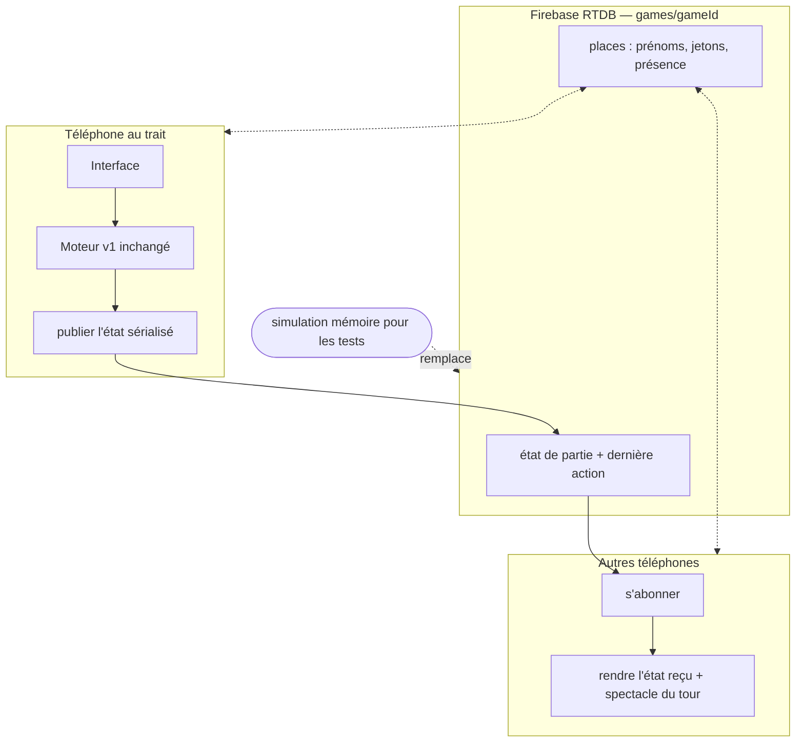

# Multi en Ligne en Direct - Plan

## Goal Capsule

- **Objectif :** un 4ᵉ mode « À distance » : Leslie crée une partie, partage un lien, et 2 à 5 personnes jouent la même partie de Yam en direct, chacune depuis son propre téléphone — règles familiales strictement identiques aux autres modes.
- **Autorité produit :** Leslie. Le contrat v1 (`docs/plans/2026-07-17-001-feat-jeu-yam-solo-plan.md`) reste le référentiel intangible des règles du jeu ; le présent contrat ne porte que le mode à distance.
- **Hiérarchie d'autorité :** le Product Contract (le QUOI) prime sur le Planning Contract (le COMMENT) ; toute question de comportement produit non tranchée est un blocage — s'arrêter et demander, ne pas inventer.
- **Profil d'exécution :** agent autonome pour U1-U6 ; U7 (preuve sur le vrai service et publication) se fait avec vérification humaine/Claude. Les tests (Verification Contract) doivent être verts avant de poursuivre au-delà de chaque unité.
- **Blocages ouverts :** la création du compte Firebase par Leslie (guidée, ~5 minutes) est requise pour U7 et pour la configuration réelle de U3 ; U1-U6 s'exécutent sans.

---

## Product Contract

### Summary

Depuis l'écran d'accueil, Leslie crée une partie « À distance » et obtient un lien à partager ; chaque invité l'ouvre, entre son prénom — sans aucun compte — et la partie se joue en direct : chacun voit les feuilles, les lancers et les annonces des autres au fil de l'eau.
La partie vit en ligne : elle attend les absents, se reprend depuis n'importe quel appareil, et ne dépend d'aucun téléphone en particulier.
Les modes locaux existants restent intacts et 100 % locaux, pour Leslie comme pour quiconque possède l'adresse du jeu.

### Key Decisions

- **Jeu en direct, tous connectés en même temps** (session-settled: user-directed — chosen over des tours par correspondance au long cours : reprise de la décision du cadrage v1, comme autour de la table).
- **Invitation par lien seulement** (session-settled: user-directed — chosen over lien + code court à dicter : la porte d'entrée la plus simple, un seul geste de partage).
- **La partie attend les absents, place réservée indéfiniment** (session-settled: user-directed — chosen over « l'hôte joue pour l'absent » et « tour sauté après délai » : esprit famille, personne ne joue à ta place, personne ne te saute).
- **Un unique compte de service, propriété de Leslie, créé une seule fois** (session-settled: user-approved — chosen over toute forme de comptes joueurs : les invités ne créent jamais rien ; clarifié en dialogue : ce compte héberge le « cahier partagé » des parties en direct, il ne se recrée pas par partie).
- **Reprise de place par prénom, depuis n'importe quel appareil** (session-settled: user-approved — chosen over une identité liée à l'appareil : un téléphone qui meurt ne bloque pas la partie ; le risque d'usurpation entre proches est assumé).
- **Pas d'ordinateur dans les parties en ligne** (session-settled: user-approved — chosen over des parties mixtes humains + IA : parties 100 % humaines en v1 du multi).

### Actors

- A1. Leslie — créatrice de la partie et joueuse ; propriétaire du compte de service.
- A2. Les invités — 1 à 4 autres personnes ; rejoignent par le lien, jouent sous leur prénom, ne créent jamais de compte.
- A3. Le service temps réel — système externe gratuit qui héberge l'état des parties en direct ; invisible pour les joueurs.

### Requirements

**Créer et rejoindre**

- R1. L'écran d'accueil propose le mode « À distance » ; créer une partie produit immédiatement un lien partageable (partage natif du téléphone + copie manuelle).
- R2. Ouvrir le lien mène à la partie : saisie du prénom, puis entrée — aucun compte, aucune installation, jamais. Un prénom déjà présent dans la partie est refusé à l'entrée, avec invitation à se distinguer (initiale, surnom) : chaque prénom désigne toujours une personne unique. Le lien ouvre toujours la même page, qui s'adapte : avant le lancement, le champ « ton prénom » ; après, la liste des places — les places déconnectées se reprennent d'un toucher, les actives sont grisées, et un visiteur sans place lit « Partie en cours — complète ».
- R3. 2 à 5 joueurs ; la salle d'attente est la même pour tous — chacun voit la liste des prénoms entrés se compléter en direct, avec la mention « En attente du lancement par {créatrice}… » ; le bouton de lancement, réservé à la créatrice, ne s'active qu'à partir de deux joueurs présents (créatrice comprise) ; une fois lancée, la partie n'accepte plus de nouveau joueur.
- R4. Chaque action de jeu (lancer, garde, annonce, inscription, barrage) apparaît chez tous les joueurs en quasi temps réel.

**Jouer ensemble**

- R5. Le tour d'un joueur distant s'affiche chez les autres comme le tour de l'ordinateur aujourd'hui : bascule sur sa feuille, ses dés, ses gardes, ses annonces, son inscription surlignée — au rythme réel du joueur.
- R6. Les onglets donnent accès aux feuilles de tous ; les annonces Tam s'affichent chez tout le monde ; le moteur, les barèmes et les garde-fous sont strictement ceux du contrat v1 — aucune divergence de règle entre les modes.
- R7. Écran de fin : classement complet des joueurs, égalités affichées comme telles, feuilles consultables.

**Absences et reprises**

- R8. En cas de déconnexion d'un joueur (téléphone fermé, réseau perdu), la partie attend : les autres voient « On attend {prénom}… » sans limite de temps ; sa place lui reste réservée ; pendant l'attente, les onglets restent pleinement consultables — le bandeau n'immobilise pas l'écran.
- R9. Reprendre sa place : rouvrir le lien — depuis n'importe quel appareil — et toucher son prénom ; l'appareil d'origine, lui, reprend automatiquement sans étape. La reprise vaut aussi en salle d'attente : quiconque était entré retrouve sa place en rouvrant le lien — créatrice comprise, avec son rôle et le bouton de lancement.
- R10. Les parties en ligne vivent indépendamment des parties locales : démarrer ou effacer une partie locale sur un appareil n'affecte jamais une partie en ligne en cours, et réciproquement.

**Le service et la propriété**

- R11. Un unique compte de service gratuit, créé une seule fois par Leslie (accompagnée pas à pas) ; il n'apparaît jamais aux joueurs ; aucune donnée personnelle au-delà des prénoms choisis et de l'état des parties.
- R12. Les modes locaux restent utilisables par quiconque possède l'adresse du jeu, sans jamais solliciter le service ; l'usage familial du mode à distance tient dans l'offre gratuite du service.
- R13. La fluidité prime : toute attente liée au réseau est nommée à l'écran (« connexion… », « on attend… ») — l'interface ne fige jamais sans explication. Les échecs francs ont un message et une issue : « Connexion impossible — réessayer » à la création de partie ; « Cette partie n'existe plus », avec retour à l'accueil, pour un lien mort.

**Enchaîner les manches**

- R14. Depuis l'écran de fin, la créatrice peut « Rejouer avec ce groupe » : une nouvelle manche démarre immédiatement avec les mêmes joueurs, sans nouveau lien à partager ; les feuilles vierges apparaissent d'elles-mêmes chez tous.

### Key Flows

- F1. Créer et inviter
  - **Trigger :** Leslie touche « À distance » sur l'écran d'accueil.
  - **Steps :** elle entre son prénom → la partie est créée et le lien affiché → partage (bouton natif ou copie) → chaque invité ouvre le lien, entre son prénom, apparaît dans la salle d'attente → Leslie lance quand tout le monde est là.
  - **Covers :** R1, R2, R3.
- F2. Un tour à distance
  - **Trigger :** c'est au tour d'un joueur.
  - **Steps :** il joue sur son téléphone avec exactement les gestes du jeu actuel (lancers, gardes, aperçu, confirmation) ; chez les autres, son tour s'affiche en direct comme un tour d'ordinateur aujourd'hui ; le passage au joueur suivant est automatique.
  - **Covers :** R4, R5, R6.
- F3. Déconnexion et reprise
  - **Trigger :** un joueur perd le réseau ou ferme son téléphone.
  - **Steps :** les autres voient « On attend {prénom}… » → il rouvre le lien (même appareil : reprise automatique ; autre appareil : il touche son prénom) → il reprend exactement où il en était, mi-tour compris.
  - **Covers :** R8, R9.

### Acceptance Examples

- AE1. **Covers R2.** Given un lien de partie partagé, When un invité l'ouvre et entre « Léa », Then elle apparaît dans la salle d'attente de la créatrice — sans avoir rien créé ni installé.
- AE2. **Covers R4, R5.** Given une partie lancée à trois, When le joueur au trait garde deux dés et relance, Then les deux autres voient la garde puis la relance en quasi temps réel, sur la feuille du joueur au trait.
- AE3. **Covers R8, R9.** Given Léa au trait qui ferme son téléphone, Then les autres voient « On attend Léa… » sans limite ; When elle rouvre le lien sur un autre appareil et touche « Léa », Then elle reprend mi-tour — dés, relances restantes et annonce Tam compris.
- AE4. **Covers R10.** Given une partie en ligne en cours, When la créatrice démarre une partie solo locale sur son téléphone, Then la partie en ligne reste intacte et rejoignable.
- AE5. **Covers R6.** Given une annonce « Tam : Full » d'un joueur distant, Then la bannière d'annonce s'affiche chez tous les joueurs.
- AE6. **Covers R2.** Given une partie où « Léa » est déjà entrée, When une seconde invitée tape « Léa », Then l'entrée est refusée avec l'invitation à se distinguer — jamais deux prénoms identiques dans une partie.
- AE7. **Covers R14.** Given une partie terminée, When la créatrice touche « Rejouer avec ce groupe », Then une manche vierge démarre chez tous les joueurs sans nouveau lien.

### Success Criteria

- Une vraie partie familiale à trois téléphones ou plus se joue de bout en bout avec pour seule consigne : « clique le lien, mets ton prénom ».
- Une coupure réseau n'est jamais fatale : la partie attend, la reprise est complète, mi-tour compris.
- Les invités utilisent librement les modes locaux (solo, contre l'ordinateur, à plusieurs sur un téléphone) sans aucun effet sur les parties en ligne.

### Scope Boundaries

Hors périmètre de cette version : ordinateur dans les parties en ligne ; chat ou messages intégrés ; spectateurs ; parties par correspondance (tours étalés dans le temps) ; comptes joueurs ; historique des parties en ligne.

### Dependencies / Assumptions

- Les règles du moteur existant (barèmes, garde-fous, ordre des colonnes) sont réutilisées sans aucune modification ; l'ajout du mode à distance étend uniquement l'enveloppe des modes — nouvelle valeur de mode, classement de fin généralisé au-delà du mode local, activation des joueurs distants déjà prévus par l'interface des joueurs. Toute divergence de règle entre modes reste un défaut.
- Le mode à distance requiert le réseau ; les modes locaux continuent de fonctionner sans.
- Le choix du service temps réel appartient au plan technique, sous contraintes : gratuit pour l'usage familial, sans serveur à entretenir, compatible avec un site statique, clés embarquables publiquement sans danger.

### Outstanding Questions

- **Deferred to Implementation :** contenu exact des textes d'attente et d'erreur (ton, formulations) dans l'esprit des écrans existants.
- **Reporté (revue du contrat), avec défaut d'exécution :** le retrait d'un prénom de la salle d'attente par la créatrice n'est pas retenu en v1 (défaut confirmé en synthèse de plan : une faute de frappe se répare en recréant la partie, ~30 secondes) ; à réévaluer après les premières parties réelles.
- **Resolve Before Planning :** aucun.

---

## Planning Contract

*Product Contract préservé après revue (10 corrections appliquées) ; seule la question reportée porte désormais son défaut d'exécution, confirmé lors de la synthèse du plan.*

### Key Technical Decisions

- KTD1. **Firebase Realtime Database, plan gratuit Spark** (session-settled: user-approved — le principe du service unique a été validé en dialogue, le choix précis délégué à une recherche 2026 ; chosen over Supabase Realtime — projets gratuits mis en pause après 7 jours d'inactivité, rédhibitoire pour un jeu occasionnel —, Cloud Firestore — pas de présence native —, Ably — clé publique = tous droits sans serveur de jetons —, PartyKit/Deno/Convex — exigent du code serveur déployé). Atouts décisifs : SDK ES modules servi par le CDN officiel sans compilation, présence native (`onDisconnect`) pour « On attend X », règles de sécurité par chemin conçues pour des clés embarquées publiquement, gratuit sans carte bancaire, limites (100 connexions simultanées, 1 Go, 10 Go/mois) ≈ 20 fois l'usage familial.
- KTD2. **La partie vit sur le service** : `games/{gameId}` porte l'état de partie sérialisé complet (réutilisation de `src/engine/serialize.js`), la dernière action, les places et leur présence. L'appareil du joueur au trait applique l'action au moteur local puis publie l'état ; les autres appareils rendent l'état reçu. Un seul appareil écrit à la fois (verrou de tour par place).
- KTD3. **Couche réseau isolée** : `src/net/` expose une petite interface (créer, rejoindre, réclamer une place, publier, s'abonner, présence) avec deux implémentations — Firebase (réelle) et une simulation en mémoire pour les tests. Le SDK Firebase est chargé par import dynamique uniquement à l'entrée du mode À distance : les modes locaux restent zéro dépendance, hors ligne, inchangés.
- KTD4. **Identité de place par jeton local** : chaque place réclamée dépose un jeton aléatoire dans le stockage local, par partie et par place. Reprise automatique quand l'appareil possède exactement un jeton de la partie ; s'il en possède plusieurs (appareil partagé, tests multi-onglets) ou aucun, la porte adaptative affiche la liste des places (R2).
- KTD5. **Lien fragment** : `https://l-nicolai.github.io/jeu-yam/#p/{gameId}` — compatible hébergement statique, aucun routage serveur ; `gameId` = identifiant aléatoire non devinable (~20 caractères). Règles Firebase : lecture refusée à la racine (aucune énumération possible), lecture/écriture uniquement sous `games/{gameId}`, validation de la forme du document.
- KTD6. **Les dés sont générés par l'appareil du joueur au trait** — autorité locale, sans vérification serveur : cohérent avec le cadre de confiance familial assumé au contrat (risque documenté, non combattu).
- KTD7. **Étanchéité des sauvegardes** : l'état des parties en ligne ne transite jamais par la clé de sauvegarde locale existante (`yam-leslie-partie`) ; seuls les jetons de place vivent localement, sous une clé distincte. R10 est structurel, pas conventionnel.
- KTD8. **Présence par `onDisconnect`** : chaque place maintient un indicateur de connexion géré par le service ; sa disparition déclenche « On attend {prénom}… » chez les autres, sa réapparition la reprise — y compris en salle d'attente (R9).

### High-Level Technical Design



Le moteur ne change pas ; seul le trajet de l'état change — publié au lieu d'être seulement affiché. La simulation en mémoire rejoue exactement l'interface de la couche réseau, ce qui rend le mode testable sans le service.

### Assumptions

- Navigateurs cibles inchangés (Safari iOS, Chrome Android récents) ; l'API de partage native est utilisée quand elle existe, la copie sinon.
- La procédure guidée de création du compte Firebase (console, mode verrouillé, collage des règles fournies, récupération de la configuration) est faite par Leslie avant U7 ; les clés obtenues sont publiques par conception et committables.

---

## Output Structure

```text
jeu-yam/
├── src/
│   ├── net/
│   │   ├── fake.js               simulation mémoire (tests et développement)
│   │   ├── firebase.js           implémentation réelle (SDK CDN, import dynamique)
│   │   └── config.js             configuration Firebase (clés publiques — remplie après création du compte)
│   ├── ui/
│   │   └── online.js             porte adaptative, salle d'attente, lien, attente et reprises
│   └── …                         (fichiers v1 étendus : app.js, endgame.js, storage.js, game.js)
├── docs/reference/
│   └── firebase-rules.json       règles de sécurité prêtes à coller dans la console
└── tests/
    └── online.test.js            deux clients simulés, partie complète et reprises
```

---

## Implementation Units

### U1. Enveloppe du mode À distance dans le moteur

- **Goal :** le moteur accepte des parties en ligne sans qu'aucune règle ne bouge.
- **Requirements :** Dependencies (enveloppe des modes) ; R6, R7.
- **Dependencies :** aucune.
- **Files :** `src/engine/game.js`, `src/engine/players.js`, `tests/game.test.js`.
- **Approach :** nouvelle valeur de mode « à distance » ; joueurs `kind: 'remote'` activés (déjà prévus par l'interface des joueurs) ; classement de fin généralisé à N joueurs pour ce mode (réutilise le chemin du mode local) ; pas d'écran de passage de téléphone en ligne ; `rules.js`, `scoring.js`, `serialize.js` strictement intouchés.
- **Test scenarios :** partie générative à 3 joueurs en mode à distance (moteur seul) sans blocage ; classement avec égalité ; sérialisation aller-retour d'une partie en ligne mi-tour ; les 54 tests v1 restent verts.
- **Verification :** `node --test tests/` entièrement vert.

### U2. Couche réseau : interface et simulation mémoire

- **Goal :** tout le protocole du multi, prouvé par tests sans le service.
- **Requirements :** R2, R3, R4, R8, R9, R14 (côté protocole) ; KTD3, KTD4.
- **Dependencies :** U1.
- **Files :** `src/net/fake.js`, `tests/online.test.js`.
- **Approach :** interface minimale — créer une partie, rejoindre (unicité du prénom), réclamer une place (jeton), publier l'état, s'abonner, signaler la présence, relancer une manche ; la simulation mémoire implémente tout avec des abonnés en mémoire, utilisable par deux « clients » dans le même test.
- **Test scenarios :** deux clients simulés jouent une partie complète de bout en bout ; unicité des prénoms (AE6) ; claim d'une place déconnectée et reprise mi-tour (AE3, côté protocole) ; « Rejouer avec ce groupe » réutilise les places (AE7) ; le verrou de tour refuse une publication hors de son tour ; l'indépendance vis-à-vis de la sauvegarde locale (AE4, côté stockage).
- **Verification :** `node --test tests/online.test.js` vert.

### U3. Intégration Firebase

- **Goal :** l'implémentation réelle de la couche réseau, prête à recevoir les clés.
- **Requirements :** R11, R12 ; KTD1, KTD5, KTD8.
- **Dependencies :** U2.
- **Files :** `src/net/firebase.js`, `src/net/config.js`, `docs/reference/firebase-rules.json`, `README.md` (section compte).
- **Approach :** SDK Firebase par import dynamique du CDN officiel, uniquement à l'entrée du mode À distance ; mêmes signatures que la simulation ; présence par `onDisconnect` ; `config.js` livré avec un espace réservé clairement marqué ; `firebase-rules.json` : racine illisible, lecture/écriture sous `games/{gameId}` seulement, validation de forme ; README : la procédure de création du compte en français simple (3 étapes de la console, mode verrouillé, collage des règles, récupération de la configuration).
- **Execution note :** sans compte réel, cette unité se prouve par revue et par la conformité de signatures avec la simulation ; la preuve vivante arrive en U7. Test expectation: none — l'implémentation réelle est couverte par le smoke U7 ; sa jumelle simulée porte les tests.
- **Verification :** aucune requête réseau émise tant qu'on n'entre pas en mode À distance (vérifiable au moniteur réseau).

### U4. Créer, partager, entrer : les écrans du seuil

- **Goal :** la porte du multi — création, lien, salle d'attente commune, porte adaptative.
- **Requirements :** R1, R2, R3 ; AE1, AE6.
- **Dependencies :** U1, U2.
- **Files :** `src/ui/online.js`, `src/ui/app.js`, `index.html`, `styles.css`.
- **Approach :** 4ᵉ carte sur l'écran d'accueil ; création → lien `#p/{gameId}` affiché avec partage natif (`navigator.share`) et copie ; la même page de partie s'adapte (champ prénom / liste des places / « Partie en cours — complète ») ; salle d'attente identique pour tous (prénoms en direct + « En attente du lancement par {créatrice}… ») ; bouton « Commencer » réservé à la créatrice, actif à partir de 2 joueurs ; unicité des prénoms refusée à la saisie avec message doux.
- **Test scenarios (via la simulation) :** porte adaptative dans ses trois états ; refus de prénom en double ; seuil de lancement à 2. Smoke : parcours complet à deux onglets sur la simulation.
- **Verification :** parcours créer-partager-rejoindre-lancer joué à la main (simulation).

### U5. La partie en direct

- **Goal :** jouer ensemble — chaque action visible chez tous, le tour distant en spectacle.
- **Requirements :** R4, R5, R6, R8 (bandeau) ; AE2, AE5.
- **Dependencies :** U4.
- **Files :** `src/ui/app.js`, `src/ui/grid.js`, `src/ui/online.js`, `styles.css`.
- **Approach :** au trait : les gestes v1 inchangés, chaque action publiée ; chez les autres : le pipeline du « tour de l'ordinateur » (bascule de feuille, dés, gardes, inscription surlignée) généralisé aux joueurs distants, cadencé par les actions reçues — au rythme réel du joueur, sans pauses artificielles ; onglets consultables pendant l'attente ; « On attend {prénom}… » sur perte de présence.
- **Test scenarios (simulation) :** AE2 rejoué par deux clients simulés ; annonces Tam propagées (AE5) ; le spectateur ne peut ni lancer ni inscrire (verrou visuel et protocole).
- **Verification :** partie à deux onglets fluide sur simulation ; aucune action possible hors de son tour.

### U6. Reprises, fin de partie, rejouer, échecs

- **Goal :** les moments délicats — reprendre, finir, enchaîner, échouer proprement.
- **Requirements :** R7, R9, R13, R14 ; AE3, AE7.
- **Dependencies :** U5.
- **Files :** `src/ui/online.js`, `src/ui/endgame.js`, `src/net/fake.js` (si besoin), `tests/online.test.js` (extension).
- **Approach :** reprise automatique (jeton unique) ou par liste des places ; reprise en salle d'attente y compris rôle de créatrice ; écran de fin : classement complet, « Rejouer avec ce groupe » (nouvelle manche, mêmes places, feuilles vierges poussées à tous) ; échecs nommés : « Connexion impossible — réessayer », « Cette partie n'existe plus » avec retour à l'accueil.
- **Test scenarios :** AE3 complet (déconnexion au trait, reprise mi-tour depuis un « autre appareil » simulé) ; AE7 ; lien mort → message et retour ; création sans réseau simulé → message et réessai.
- **Verification :** les scénarios dirigés passent sur simulation ; `node --test tests/` entièrement vert.

### U7. Preuve sur le vrai service et publication

- **Goal :** la démonstration vivante — une vraie partie Firebase multi-clients, puis mise en ligne.
- **Requirements :** R4, R11, R12 ; Definition of Done.
- **Dependencies :** U3, U6 ; création du compte Firebase par Leslie (guidée).
- **Files :** `src/net/config.js` (clés réelles), déploiement.
- **Approach :** Leslie crée le compte (procédure du README : console Firebase, connexion Google, Realtime Database en mode verrouillé, collage de `docs/reference/firebase-rules.json`, récupération de la configuration) ; les clés sont mises dans `config.js` ; vérification Claude : partie complète à trois onglets de navigateur sur le vrai service (AE1-AE7 rejoués), coupure d'un onglet et reprise réelle, contrôle que la racine de la base est illisible ; puis commit et publication GitHub Pages.
- **Execution note :** unité conduite avec vérification humaine/Claude — pas d'exécution autonome. Test expectation: none — c'est la campagne de preuve elle-même.
- **Verification :** les 8 lignes du Verification Contract ci-dessous, toutes vertes le même jour.

---

## Verification Contract

| Vérification | Commande / méthode | S'applique à | Obligatoire avant |
|---|---|---|---|
| Suite complète (v1 + multi) | `node --test tests/` — les 54 tests v1 restent verts, les nouveaux aussi | U1-U6 | tout commit |
| Partie simulée à deux clients | scénario complet dans `tests/online.test.js` (création → manches → reprise → rejouer) | U2, U5, U6 | clôture de U6 |
| AE tracés | AE1-AE7 du contrat ont chacun un test ou un smoke nommé | U2-U7 | Definition of Done |
| Modes locaux intacts | aucune requête réseau hors mode À distance (moniteur réseau) ; parcours solo/ordi/local inchangés | U3 | clôture de U3 |
| Preuve réelle multi-onglets | partie complète à 3 onglets sur Firebase, AE rejoués, coupure/reprise réelle | U7 | publication |
| Sécurité du service | lecture de la racine refusée (`curl` sur la base) ; lecture d'un `gameId` valide acceptée | U7 | publication |
| Étanchéité des sauvegardes | partie locale démarrée pendant une partie en ligne : aucune interférence (AE4) | U2, U7 | publication |
| Publication | Pages à jour, partie réelle rejouée sur l'URL publique | U7 | Definition of Done |

---

## Definition of Done

- Une partie réelle à trois clients (onglets ou téléphones) se joue de bout en bout sur Firebase depuis l'URL publique, reprise après coupure comprise.
- AE1-AE7 tracés et rejoués ; les 54 tests v1 et les nouveaux tests verts.
- Les modes locaux sont strictement inchangés : zéro requête réseau, zéro dépendance, parcours identiques.
- Les règles Firebase publiées interdisent l'énumération des parties ; seules les clés publiques par conception sont embarquées.
- Le README explique la création du compte et le mode À distance en français simple.
- Aucun code mort ni essai abandonné dans le dépôt.

---

## Sources & Research

Recherche comparative des services temps réel (juillet 2026, sources en ligne vérifiées) : Firebase RTDB retenu ; Supabase éliminé (pause des projets gratuits après 7 jours d'inactivité — supabase.com/docs/guides/platform/free-project-pausing) ; Firestore éliminé (pas de présence native — firebase.google.com/docs/firestore/solutions/presence) ; Ably (clé = tous droits sans serveur de jetons — ably.com/docs/platform/pricing/free) ; PartyKit/Cloudflare, Deno Deploy, Convex (code serveur à déployer). Références d'implémentation : firebase.google.com/docs/web/setup (CDN ESM), firebase.google.com/docs/database/web/offline-capabilities (`onDisconnect`, `/.info/connected`), firebase.google.com/docs/database/security/core-syntax (règles par chemin), firebase.google.com/pricing (Spark : 100 connexions, 1 Go, 10 Go/mois, sans carte bancaire).
